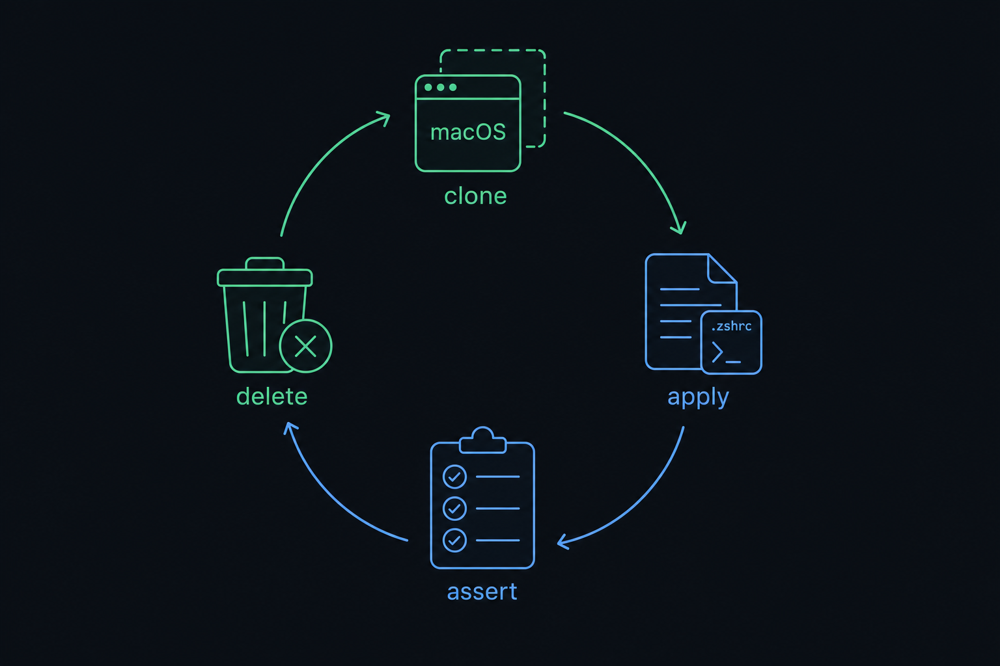
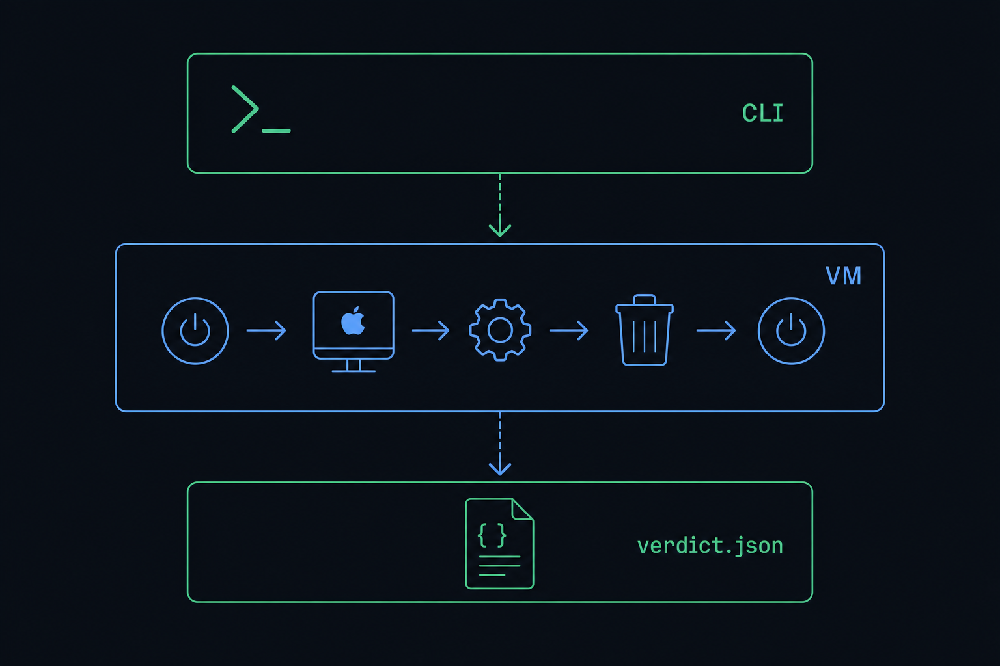

# macos-ci

[](LICENSE)
[-lightgrey)](specs/macos-ci/01-tart-core.md)
[](specs/macos-ci/10-tart-vs-utm-adr.md)
[](https://github.com/bossjones/macos-ci/actions/workflows/ci.yml)

Virtualized macOS images for testing things I don't want to run on my host yet — a local, disposable-VM
harness that installs [zsh-dotfiles](https://github.com/bossjones/zsh-dotfiles) into a clean macOS guest,
asserts it worked, and throws the VM away.

<p align="center">
   apply -> assert -> delete disposable-VM loop" width="720">
</p>

## Table of Contents

- [What Is This](#what-is-this)
- [Features](#features)
- [Architecture: Two Lanes](#architecture-two-lanes)
- [Tools Used](#tools-used)
- [Requirements](#requirements)
- [Quick Start](#quick-start)
- [Bring Up a macOS VM and Interact With It in a Window](#bring-up-a-macos-vm-and-interact-with-it-in-a-window)
- [Recipe Reference](#recipe-reference)
- [The Golden Image and How a Run Works](#the-golden-image-and-how-a-run-works)
- [Verification and the Claims Ledger](#verification-and-the-claims-ledger)
- [Project Layout](#project-layout)
- [Continuous Integration](#continuous-integration)
- [Specs and Further Reading](#specs-and-further-reading)
- [Licensing](#licensing)
- [Development and Contributing](#development-and-contributing)

## What Is This

`zsh-dotfiles` (chezmoi-managed) and `zsh-dotfiles-prep` (Homebrew/Xcode-CLT bootstrap) both have Linux
CI today — but **neither has a macOS equivalent**. Docker can't run a macOS guest, and GitHub's hosted
`macos-14`/`macos-latest` runners are remote, queued CI, not a local, fast, disposable-VM loop you can
run in seconds while editing a template. That gap is this repo's entire reason to exist.

**macos-ci closes it.** Clone a golden image, mount your dotfiles tree in, run `chezmoi apply`
non-interactively, assert it worked, throw the VM away — the same install-and-assert loop Linux already
gets from `docker run`, for macOS.

<p align="center">
  
</p>

## Features

- 🖥️ **Disposable per-run VMs** — `tart clone` gives a byte-identical clone in seconds; `tart delete`
  throws it away when the run ends. The golden image itself is never mutated.
- 📦 **Reproducible golden image** — Packer + `packer-plugin-tart` bakes Xcode CLT, Homebrew, `retry`,
  and chezmoi ≥ 2.20.0 once; `zsh-dotfiles` itself is mounted fresh per run, never baked in.
- 🤖 **Non-interactive chezmoi apply** — installs run over an SSH session with no TTY attached, which is
  exactly what makes chezmoi's `stdinIsATTY` gate resolve every prompt to its documented default.
- 🧪 **Four test tiers** — hermetic unit tests, `testinfra` assertions over SSH, `pexpect`-over-PTY, and
  VNC-screenshot GUI checks, each behind its own `just verify-*` recipe.
- 🖼️ **A real GUI escape hatch** — the UTM lane boots a windowed macOS guest with an actual iTerm2
  session inside it, for eyeballing prompt rendering, plugin behavior, and colors a headless run can't
  show you.
- 🔎 **Host-side IP discovery, no guest agent required** — the UTM lane finds a macOS guest's IP by
  reading its MAC from `config.plist` and matching it against `/var/db/dhcpd_leases`, because
  Apple-backend macOS guests have no QEMU guest agent to ask directly.
- 📋 **A machine-verified claims ledger** — every load-bearing assertion in `specs/` is backed by
  evidence `just verify-claims` re-executes; `just check` is this project's actual definition of done.
- 🔐 **Secret-free builds** — the Homebrew token is injected via Packer's `environment_vars`, never
  written to the guest filesystem, and a leak canary (`just verify-no-secrets`) proves it.
- 📄 **A machine-readable verdict** — `just run` always writes `artifacts/<run-id>/verdict.json`, so a
  human and an agent can both tell what broke.

## Architecture: Two Lanes

**Tart is primary. UTM is the escape hatch.** Neither tool has a Terraform provider, and no Packer
builder exists for UTM — full reasoning in the [ADR](specs/macos-ci/10-tart-vs-utm-adr.md).

| | 🟢 Tart lane (automated) | 🟠 UTM lane (manual GUI escape hatch) |
|---|---|---|
| **Role** | Drives CI and the automated harness | Interactive/GUI work, recovery-mode fiddling |
| **Build pipeline** | Packer + `packer-plugin-tart` | None — hand-built or AppleScript |
| **Guest automation** | SSH over `tart --dir` shared mounts — always available | Lifecycle + host-side serial only; no QEMU guest agent on an Apple-backend macOS guest |
| **Guest IP** | `tart ip <vm>` | No native equivalent — discovered host-side from `config.plist` MAC + `/var/db/dhcpd_leases` |
| **Disposable VMs** | `tart clone` / `tart delete`, instant | UTM's disposable ("run without saving") mode is QEMU-backend only — doesn't reach macOS guests |
| **Teardown** | `tart delete` | `just utm-destroy` (session clone only; golden VM untouched) |
| **Gates CI?** | Yes — this is the automated harness | Never — always a human at the wheel |

Settled facts worth not re-deriving (from [CLAUDE.md](CLAUDE.md)):

- **No Terraform provider exists for tart or for UTM.** Tart's orchestration story is Orchard.
- **`utmctl` is a wrapper around UTM's AppleScript interface, not a second automation surface** — its
  `exec`/`file`/`ip-address` subcommands parse but can't work against a macOS guest, so there is no
  UTM-lane `tart ip`.
- **UTM's disposable mode is QEMU-backend only**, so it never applies to a macOS guest.

## Tools Used

| Tool | Role in this repo | Link |
|---|---|---|
| **Tart** | Primary VM engine — clone/run/ip/delete, OCI image registry | [tart.run](https://tart.run/) · [repo](https://github.com/cirruslabs/tart) |
| **Packer** | Builds the golden image | [developer.hashicorp.com/packer](https://developer.hashicorp.com/packer) |
| **packer-plugin-tart** | The Tart builder Packer uses | [github.com/cirruslabs/packer-plugin-tart](https://github.com/cirruslabs/packer-plugin-tart) |
| **Orchard** | Tart's multi-host orchestrator (not needed yet) | [tart.run/orchard/quick-start](https://tart.run/orchard/quick-start/) |
| **UTM** | The manual GUI escape-hatch lane | [getutm.app](https://getutm.app/) |
| **chezmoi** | Applies the dotfiles under test | [chezmoi.io](https://www.chezmoi.io/) |
| **zsh-dotfiles** | The subject under test | [github.com/bossjones/zsh-dotfiles](https://github.com/bossjones/zsh-dotfiles) |
| **Homebrew** | Package manager baked into the golden image | [brew.sh](https://brew.sh/) |
| **just** | Task runner fronting the whole CLI surface | [github.com/casey/just](https://github.com/casey/just) |
| **lychee** | Link checker for every markdown file | [lychee.cli.rs](https://lychee.cli.rs/) |
| **iTerm2** | Terminal a human evaluates dotfiles UX in, inside the UTM guest | [iterm2.com](https://iterm2.com/) |
| **mise** | Default version manager installed by the dotfiles under test | [mise.jdx.dev](https://mise.jdx.dev/) |
| **asdf** | The alternate version manager crossed in `just matrix` | [asdf-vm.com](https://asdf-vm.com/) |
| **uv** | Runs the Python `macos-ci` CLI and its tooling | [docs.astral.sh/uv](https://docs.astral.sh/uv/) |
| **Cirrus CLI** | Local/CI parity (`just ci` → `cirrus run`) | [github.com/cirruslabs/cirrus-cli](https://github.com/cirruslabs/cirrus-cli) |
| **ruff** | Lint + format | [docs.astral.sh/ruff](https://docs.astral.sh/ruff/) |
| **basedpyright** | Type checking | [docs.basedpyright.com](https://docs.basedpyright.com/) |
| **pyrefly** | Type-coverage / diff checking | [pyrefly.org](https://pyrefly.org/) |

> ⚠️ **Don't conflate licenses.** This project itself is **MIT** (see [LICENSE](LICENSE)). The tooling
> it depends on — **Tart and Orchard** — ships **Fair Source (`FSL-1.1-ALv2`)**, not permissive open
> source. See [Licensing](#licensing) below.

## Requirements

Everything `just doctor` checks before it lets any lifecycle recipe run:

| Requirement | Needed |
|---|---|
| `tart` | ≥ 2.0.0 |
| `packer` | ≥ 1.10.0 |
| `just` | present |
| `uv` | present |
| `cirrus` | present |
| `sshpass` | present |
| CPU | Apple Silicon (`arm64`) |
| macOS | ≥ 13.0 |
| Login keychain | unlocked |
| `ZSH_DOTFILES` | checkout present on disk |
| Free disk space | ≥ 60 GB |
| `utm` | optional (only needed for the UTM lane) |

Real output, captured on this machine:

```bash
$ just doctor
[     OK] tart                     required=>=2.0.0      found=2.32.1
[     OK] packer                   required=>=1.10.0     found=1.15.4
[     OK] just                     required=present      found=1.42.4
[     OK] uv                       required=present      found=0.11.14
[     OK] cirrus                   required=present      found=1.0.0-1769788
[     OK] sshpass                  required=present      found=1.10
[     OK] apple-silicon            required=arm64        found=arm64
[     OK] macos-version            required=>=13.0       found=26.5.2
[     OK] login-keychain-unlocked  required=unlocked     found=unlocked
[     OK] ZSH_DOTFILES             required=exists       found=/Users/bossjones/dev/bossjones/zsh-dotfiles
[     OK] free-disk-space          required=>=60GB       found=2142.27GB
[     OK] fleet-ceiling            required=report-only  found=≤03 hosts / ≤100 combined CPU cores (G4 accepted-risk, see README.md)
[     OK] utm                      required=optional     found=4.7.5
```

`doctor` exits `2` if anything required is missing. Pass `--json` for the machine-readable form an agent
reads instead of scraping this table.

## Quick Start

```bash
git clone git@github.com:bossjones/macos-ci.git
cd macos-ci
uv sync
just doctor       # preflight — see Requirements above for real captured output
```

See everything you can run (real, captured on this machine — full recipe descriptions in
[Recipe Reference](#recipe-reference) below):

```bash
$ just --list
Available recipes:
    apply                  # Only the chezmoi apply, against an already-live VM. Fast iteration.
    build-golden           # ... [alias: build]
    build-ipsw VERSION     # Packer build from a pinned IPSW. Verifies sha256 before building.
    check                  # The full truth gate. Everything an agent must pass before a spec is trustworthy.
    doctor *ARGS           # Preflight every requirement. --json for agents. Exit 2 if anything is missing.
    down                   # Stop the VM, leave the clone on disk. [alias: stop]
    ssh                    # Interactive shell into the VM.
    up                     # `harness` is a sub-app (`cli.py: app.add_typer(harness.app, name="harness")`).
    utm-up                 # Clone-if-missing -> windowed start -> MAC->leases IP -> two-phase SSH -> state.json.
    ... (55 recipes total)
```

Then run the whole cycle in one shot:

```bash
just run    # doctor -> up -> chezmoi apply -> verify -> destroy; always writes verdict.json
```

> `just run` drives a real Tart VM, so it needs the requirements above (Apple Silicon, macOS ≥ 13.0). The
> `verdict.json` shape below is **illustrative**, not a captured run — see
> [12-tooling-and-agent-loop.md](specs/macos-ci/12-tooling-and-agent-loop.md) for the `artifacts/`
> contract:
> ```json
> {
>   "run_id": "20260711-091500-004821",
>   "vm": "dotfiles-test",
>   "image": "sequoia",
>   "status": "pass",
>   "steps": {"doctor": "ok", "up": "ok", "apply": "ok", "verify": "ok", "destroy": "ok"}
> }
> ```

## Bring Up a macOS VM and Interact With It in a Window

Two lanes, two purposes: **Tart** for automated headless (or VNC-observed) runs, **UTM** for a real
windowed macOS GUI you drive by hand.

### Tart lane — headless, SSH, and an optional GUI/VNC window

```bash
just up                    # tart clone -> tart run --no-graphics & -> poll `tart ip` -> 2-phase SSH bootstrap
just ssh                   # interactive shell into the guest
just exec "chezmoi status" # one-shot remote command
```

`just up` clones the golden image, boots it **headless**, mounts your `zsh-dotfiles` checkout in via
`tart --dir` (read-only, surfacing at `/Volumes/My Shared Files/dotfiles` inside the guest), polls
`tart ip` every 2 seconds up to 120 seconds until it reports an address, then bootstraps SSH key trust in
two phases — one password-authenticated connection (`admin`/`admin`, via `sshpass`) to seed the
harness's own public key into `authorized_keys`, then key-based `BatchMode=yes` SSH forever after. Full
sequence: [tutorial 2](docs/tutorials/02-running-the-harness.md#just-up--clone-boot-bootstrap-ssh).

To actually **see** the guest instead of running fully headless:

```bash
just gui       # tart run WITH a window, for poking at it by hand
just vnc       # tart run --vnc-experimental, prints the VNC target
just shot done # capture one framebuffer PNG into artifacts/<run-id>/screenshots/
```

```bash
$ just vnc
Opening vnc://:enhance-chase-volume-push@127.0.0.1:59415...
```
> Output above is **illustrative** — quoted from
> [12-tooling-and-agent-loop.md](specs/macos-ci/12-tooling-and-agent-loop.md), where
> `--vnc-experimental`'s stdout format is itself marked `<!-- UNVERIFIED -->`. `just vnc` and
> `just shot` are also flagged in [spec 14](specs/macos-ci/14-known-discrepancies.md) as broken/stubbed
> today — see the ⚠️ column in [Recipe Reference](#recipe-reference) for the exact status of each.

The fast day-to-day iteration loop:

```bash
just up
# ...edit something in your zsh-dotfiles checkout...
just apply     # chezmoi init -> diff -> apply, no reboot or reclone needed
just ssh
$ chezmoi status
$ exit
just down      # or: just destroy
```

### UTM lane — a real windowed macOS guest, with iTerm2 inside it

This is where you get an actual GUI window and drive a real interactive session — the escape hatch for
eyeballing prompt rendering, plugin behavior, and colors a headless run can't show you.

```bash
just utm-up                  # clone-if-missing -> windowed boot -> host-side IP discovery -> SSH bootstrap
just utm-gui                 # bring the UTM window forward (open -a UTM)
just utm-bootstrap-dotfiles  # prints a mount + `chezmoi apply` block -- paste it into the guest's iTerm2
just utm-ssh                 # SSH feedback channel, if you don't want to touch the GUI window
just utm-verify-manual       # walks a 7-item iTerm2 UX checklist: glyphs, sheldon highlighting, Ctrl-R, colors...
just utm-destroy             # deletes the session clone only -- the golden VM is untouched
```

The apply itself is **human-run, not harness-run** — you paste the printed block into the UTM window's
iTerm2 and watch it happen yourself; SSH is the feedback channel, not the applier.

**No guest agent, so no `utmctl ip-address`.** Apple-backend macOS guests can't run the QEMU guest agent
UTM's AppleScript automation needs, so `just utm-up`/`just utm-ip` find the guest's IP from the host
side instead: read every VM MAC address out of the `.utm` bundle's `config.plist`, match it against
`/var/db/dhcpd_leases` (falling back to `arp -an`), and only fall back to the serial console
(`just utm-serial` → `utmctl attach`) if that fails. See
[05-utm-automation.md §4.5](specs/macos-ci/05-utm-automation.md) for the full mechanism.

#### 📸 Screenshot: iTerm2 inside the UTM guest

> **Placeholder — not yet captured.** This README ships the walkthrough above without a real screenshot
> of iTerm2 running inside a UTM guest window (glyph rendering, sheldon syntax highlighting, `Ctrl-R`
> history search, 24-bit color). Capturing one for real means booting `just utm-up`, pasting the
> bootstrap block, and screenshotting the window — genuine work, tracked as a **follow-up
> `/agent-harness:plan` spec**, not fabricated here. In the meantime, here's the shape of the loop it'll
> capture:

<p align="center">
  
</p>

## Recipe Reference

Every `just` recipe, grouped the way the [Justfile](Justfile) itself groups them. ⚠️ marks recipes
[spec 14](specs/macos-ci/14-known-discrepancies.md) documents as broken or stubbed today — each is
backed by a `.team/claims.jsonl` entry so `just verify-claims` catches it the moment it's fixed.

**Truth gate & build**

| Recipe | What it does |
|---|---|
| `link-check` | Check every link in every markdown file with lychee. |
| `link-check-verbose` | Same, with verbose lychee output. |
| `link-check-fresh` | Same, bypassing lychee's 7-day cache. |
| `verify-claims` | Re-execute the evidence behind every claim in `.team/claims.jsonl`. |
| `verify-claims-json` | Same, machine-readable — what an agent reads instead of scraping prose. |
| `verify-no-secrets vm` | Leak canary: assert the Homebrew token appears nowhere in a built VM's artifact. |
| `unverified-count` | Count `<!-- UNVERIFIED -->` markers — the honesty budget. |
| `check` | **The full truth gate**: `link-check` + `verify-claims` + `unverified-count`. |
| `build-golden` (alias `build`) | Build the golden Tart image via Packer. ⚠️ *Fails today* — `packer/tart-golden-image.pkr.hcl` template wiring is tracked as OQ-04. |

**Lifecycle**

| Recipe | What it does |
|---|---|
| `doctor *ARGS` | Preflight every requirement. `--json` for agents. Exit 2 if anything is missing. |
| `up` | `tart clone` → `tart run --no-graphics &` → poll `tart ip` → wait for SSH. |
| `down` (alias `stop`) | Stop the VM, leave the clone on disk. |
| `destroy` | Delete the VM clone. |
| `recreate` | `destroy` then `up`. |
| `run` | The main loop: doctor → up → chezmoi diff → apply → verify → destroy. Always writes `verdict.json`. |
| `apply` | Only the chezmoi apply, against an already-live VM. Fast iteration. |
| `prune` | Delete orphan clones not tracked under `artifacts/`. |

**Images**

| Recipe | What it does |
|---|---|
| `build-ipsw VERSION` | ⚠️ Packer build from a pinned IPSW (verifies sha256 first) — calls a top-level CLI command that doesn't exist yet. |
| `images` | Print `macos-versions.toml` alongside `tart list`. |
| `pull IMAGE` | ⚠️ `tart pull` the OCI ref for IMAGE — calls a top-level CLI command that doesn't exist yet. |

**Inspection**

| Recipe | What it does |
|---|---|
| `ssh` | Interactive shell into the VM. |
| `exec CMD` | One-shot remote command in the VM. |
| `logs` | ⚠️ Sweep guest logs into `artifacts/<run-id>/logs/` — the Justfile calls `macos-ci logs`, but the real command lives under `macos-ci harness logs`. |
| `debug` | Triage a VM's log sources for known failure signatures; writes `verdict.json`. |
| `status` | `tart list` plus a pretty-printed `artifacts/latest/state.json`. |
| `gui` | `tart run` **with a window**, for poking at it by hand. |
| `vnc` | ⚠️ `tart run --vnc-experimental` — the Justfile calls `macos-ci gui vnc`, which doesn't exist (only `shot` is defined). |
| `shot LABEL` | ⚠️ Capture one framebuffer PNG into `artifacts/<run-id>/screenshots/` — the command exists but its body is an unconditional `NotImplementedError` stub. |

**Testing**

| Recipe | What it does |
|---|---|
| `test` | Hermetic units. No VM. What an agent runs by default. |
| `verify` | `-m vm` — `testinfra` assertions over SSH. |
| `verify-pty` | `-m pty` — `pexpect` over `ssh -tt`. |
| `verify-gui` | `-m gui` — VNC screenshots. |
| `verify-manual` | `-m manual` — the only recipe that may ever prompt a human. |
| `matrix` | Cross-product of image × version_manager. |

**Quality**

| Recipe | What it does |
|---|---|
| `lint` | `ruff check .` |
| `fmt` | `ruff format .` |
| `typecheck` | `basedpyright` |
| `ci` | `cirrus run`, for local/CI parity. |
| `check-pyrefly` | pyrefly type check — fails only on errors new since the committed baseline. |
| `pyrefly-baseline` | Refresh the committed pyrefly baseline. |
| `pyrefly-coverage` | Type-coverage report (typed / `Any` / untyped) as JSON. |

**UTM (manual GUI lane — never gates CI)**

| Recipe | What it does |
|---|---|
| `utm-doctor` | UTM.app version, golden-bundle presence, leases readability. `just doctor` never fails when UTM is simply absent. |
| `utm-import-golden` | One-time: stage the Tart golden disk as raw + print the manual GUI import checklist. |
| `utm-clone` | `utmctl clone` golden → session VM; no-op if it already exists. |
| `utm-up` | Clone-if-missing → windowed start → MAC→leases IP → two-phase SSH → `state.json`. |
| `utm-gui` | `open -a UTM` — bring the GUI window forward. |
| `utm-bootstrap-dotfiles` | Print the guest-side VirtioFS mount + `chezmoi apply` block to paste into iTerm2. |
| `utm-ip` | The `tart ip` equivalent for the UTM lane (host-side MAC → `dhcpd_leases`/`arp`). |
| `utm-ssh` | Interactive shell into the UTM VM. |
| `utm-exec CMD` | One-shot remote command over the same SSH. |
| `utm-serial` | Redirect serial I/O to this terminal — the only guest channel `utmctl` offers without a QEMU guest agent. |
| `utm-status` | `utmctl list`. |
| `utm-stop` | Graceful stop (request mode). |
| `utm-destroy` | Delete the session clone; the golden VM is untouched. |
| `utm-verify-manual` | The seven-item iTerm2 UX checklist, JSON-reported. Prompts on a TTY, skips cleanly off-TTY. |

## The Golden Image and How a Run Works

The golden image supplies exactly what `zsh-dotfiles` assumes but never installs itself: **Xcode CLT,
Homebrew, `retry`, and chezmoi ≥ 2.20.0**. It's built once, on the `-vanilla` base image — deliberately
**not** on `-base` (which already ships `mise` and would let the harness report green having never
exercised installing it) — and it deliberately does **not** bake in `zsh-dotfiles-prep` or the dotfiles
themselves; those stay changing, per-run inputs.

A run is: **`tart clone`** the golden image → **mount** the dotfiles tree via `tart --dir` → **SSH**
in with no TTY attached → **`chezmoi apply`** → **assert** → **`tart delete`**. See
[08-dotfiles-test-harness.md](specs/macos-ci/08-dotfiles-test-harness.md) and
[02-packer-tart-builder.md](specs/macos-ci/02-packer-tart-builder.md) for the full design, and
[13-build-secrets.md](specs/macos-ci/13-build-secrets.md) for how the Homebrew token gets to the build
without ever touching the guest filesystem.

> ⚠️ `just build-golden` currently fails — see the Recipe Reference table above and
> [spec 14](specs/macos-ci/14-known-discrepancies.md).

## Verification and the Claims Ledger

This repo has a strict honesty culture: every load-bearing assertion in `specs/` is backed by an entry
in [`.team/claims.jsonl`](.team/claims.jsonl) that a machine re-executes — file reads, `--help` probes,
and queries against the Tart/UTM doc search indexes.

```bash
just check              # link-check + verify-claims + unverified-count — the truth gate
just verify-claims      # re-run the evidence behind every claim
just verify-claims-json # same, for an agent to read instead of scraping prose
```

Exit codes: `0` verified · `2` a claim failed · `3` evidence unreachable · `4` usage. Claims that can't
be expressed this way get an explicit `<!-- UNVERIFIED -->` marker instead of presented as fact —
`just unverified-count` is the honesty budget, and it should only ever fall because a claim got
verified, never because a marker got deleted.

## Project Layout

```
macos-ci/
├── Justfile                    # the whole command surface — see Recipe Reference above
├── macos-versions.toml         # named image -> OCI ref (sequoia, tahoe)
├── LICENSE                     # MIT (this project — NOT the tooling it depends on)
├── packer/                     # golden-image + IPSW Packer templates
├── src/macos_ci/                # the `macos-ci` CLI (doctor, harness, gui, utm, vm-debug)
├── tests/                      # unit / vm / pty / gui / manual tiers
├── tools/verify_claims.py      # re-executes .team/claims.jsonl
├── .team/claims.jsonl          # the claims ledger
├── .cirrus.yml                 # Cirrus CI config (`just ci`)
├── .github/workflows/          # ci.yml + pyrefly diff/coverage workflows
├── specs/macos-ci/              # the authoritative design docs (00-14)
└── docs/tutorials/              # step-by-step user guides
```

## Continuous Integration

GitHub Actions (`.github/workflows/ci.yml`) runs two jobs on every push/PR: **lint/type/test**
(`ruff`, `basedpyright`, `codespell`, `pytest --cov`) and the **truth gate**
(`lychee-action` + `verify_claims.py --skip-local-only`). Local/CI parity for the parts that need a real
macOS host is `just ci` → `cirrus run` against `.cirrus.yml`.

## Specs and Further Reading

| File | Why |
|---|---|
| [specs/macos-ci/00-overview.md](specs/macos-ci/00-overview.md) | Start here — the problem, the stack, the file map, the reading order |
| [specs/macos-ci/10-tart-vs-utm-adr.md](specs/macos-ci/10-tart-vs-utm-adr.md) | The decision: **tart is primary, UTM is the escape hatch**, and why |
| [specs/macos-ci/11-sources.md](specs/macos-ci/11-sources.md) | Every URL, graded `[meaty]`/`[thin]`/`[404]`, with what it gave us |
| [specs/macos-ci.md](specs/macos-ci.md) | The plan-format entry point; input to `/agent-harness:plan` |
| [specs/plans/macos-ci.html](specs/plans/macos-ci.html) | A derived HTML rendering of the plan — a snapshot, not authoritative; the markdown specs win on conflict |

Suggested reading order: **00 → 10 → 01 → 02 → 13 → 08 → 09 → 12 → 03 → 04 → 05 → 06 → 07 → 11 → 14.**

## Licensing

**This project is MIT** — see [LICENSE](LICENSE).

### Accepted-risk sign-off (G4)

**Human sign-off given 2026-07-10.** Tart/Orchard ship Fair Source (`FSL-1.1-ALv2`, copyright holder
OpenAI following the Cirrus Labs acquisition announced 2026-04-07); the Free Tier is capped at **100
combined CPU cores** and **4 Orchard workers** across headless ("server installation") hosts. This
repo's accepted posture, per
[specs/macos-ci/04-tart-licensing-risk.md](specs/macos-ci/04-tart-licensing-risk.md):

- Fleet ceiling: **at most 3 hosts, at most 100 combined CPU cores**.
- Never build a competing virtualization product on top of Tart.
- `just doctor` must **report** this ceiling as a checked precondition — it must never silently approve
  it.

Re-litigate only if fleet size grows past 3 hosts or the combined core count approaches 100.

## Development and Contributing

```bash
uv sync                # install dependencies
just test               # hermetic unit tests — no VM, what an agent runs by default
just lint               # ruff check .
just fmt                # ruff format .
just typecheck          # basedpyright
just check              # the truth gate — run before opening a PR
```

The four VM-backed test tiers (`verify`, `verify-pty`, `verify-gui`, `verify-manual`) need a real Tart or
UTM VM and are macOS/Apple-Silicon only — see [Recipe Reference](#recipe-reference).
