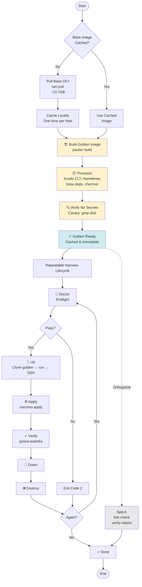

# Build Pipeline

This page traces one full cycle from "no image exists" to "a torn-down VM and a verdict," in the order
the tooling actually runs it. It has two distinct phases that are easy to conflate: building the
**golden image** (once, slow, Packer) and running the **per-test harness lifecycle** (many times, fast,
the `macos-ci` CLI). The design rationale for this split lives in
[specs/macos-ci/08-dotfiles-test-harness.md](../../specs/macos-ci/08-dotfiles-test-harness.md)
§"(a) Golden image vs. from-scratch per test" — this page documents what the checked-in code actually
does, not why it was designed that way.

## Phase 1: the golden-image build (Packer)

`just build-golden` (aliased `just build`) runs:

```
packer build packer/tart-golden-image.pkr.hcl
```

The template ([packer/tart-golden-image.pkr.hcl](../../packer/tart-golden-image.pkr.hcl)) declares one
`tart-cli` source:

- **Base**: clones `ghcr.io/cirruslabs/macos-sequoia-vanilla:latest` (the `default` entry in
  `macos-versions.toml`) — a ~23.7GB compressed OCI pull, observed directly during the 2026-07-10
  build to dominate the build's wall-clock (see the "Build performance" note in this repo's
  `CLAUDE.md`).
- **VM shape**: `vm_name = "dotfiles-golden"`, 4 CPUs, 8GB memory, 60GB disk, headless, `admin`/`admin`
  SSH credentials (deliberately *not* marked `sensitive` — Packer's masking is value-based, not
  variable-scoped, and would rewrite every occurrence of the word `admin` in every log line; see
  [specs/macos-ci/13-build-secrets.md](../../specs/macos-ci/13-build-secrets.md)
  §"`sensitive` masks values, not variables"), `recovery_partition = "delete"` set explicitly.

One `shell` provisioner does everything, inline, idempotently:

1. **Xcode Command Line Tools** — installed non-interactively via `softwareupdate -i "<product>"`
   rather than `xcode-select --install`, which pops a GUI prompt that never resolves headless.
2. **Homebrew** — installed via the standard `NONINTERACTIVE=1` installer if `brew` isn't already
   present.
3. **Brew prerequisites** — `wget curl kadwanev/brew/retry go openssl@3 readline libyaml gmp autoconf
   tmux` (the `smoke-test-docker.sh` prerequisite list), via the `kadwanev/brew` tap.
4. **chezmoi** — `brew install chezmoi` (tracks Homebrew's current formula, which is past the
   `>=2.20.0` floor `zsh-dotfiles/.chezmoiversion` requires).

The provisioner's `environment_vars` optionally injects `HOMEBREW_GITHUB_API_TOKEN` (only if one is
present in the calling shell's environment or resolvable via `gh auth token`) plus a `GIT_CONFIG_COUNT`/
`KEY_n`/`VALUE_n` triplet that rewrites the one `git@github.com:` tap URL to anonymous HTTPS. The token
is an optimization, not a dependency — it raises GitHub's API rate limit from 60 req/hr to 5,000; the
build succeeds without it either way. `use_env_var_file` stays `false`, so the token lives only in the
provisioner's process environment for the life of one SSH command — it is never written to a file
Packer would need to "clean up" (and per `CLAUDE.md`, `rm` inside the guest wouldn't erase it anyway;
see [specs/macos-ci/13-build-secrets.md](../../specs/macos-ci/13-build-secrets.md)).

Deliberately **not** part of this template: installing `zsh-dotfiles-prep`. That stays a separate,
optional matrix leg, not baked into the golden image.

### The leak-canary, not a build step

`just verify-no-secrets <vm>` is a distinct Justfile recipe, run *after* a build, not a stage inside
`packer build`. It greps the built VM's entire `~/.tart/vms/<vm>/` directory (not a single named disk
file — tart documents the directory, not the file inside it, and `disk_format` may be `raw` or `asif`)
for the literal token value, and fails loudly (`exit 2`) if found. This is a canary that asserts a
secret *never* leaked into the disk image, not a step the build depends on to succeed — a `packer build`
that never ran `verify-no-secrets` at all is still a valid, complete build. If no token is present in
the calling environment, the recipe exits 0 with "nothing to search for" rather than passing vacuously
on a real leak.

### Planned, not yet implemented: `just images-cache`

This repo's `CLAUDE.md` describes pre-pulling the base OCI image (`tart pull
ghcr.io/cirruslabs/macos-sequoia-vanilla`) so every subsequent golden-image build clones from a local
cache instead of re-pulling ~23.7GB over the network — turning future builds into a minutes-scale
provisioner run instead of an hour-scale network pull. **As of this writing, no `images-cache` recipe
exists in the checked-in `Justfile`.** The Justfile has `just images` (prints `macos-versions.toml`
alongside `tart list`) and `just pull IMAGE` (a one-off `tart pull` for a single named image), but
nothing that pre-warms the cache for every declared lane as a named, documented recipe. Treat the
pre-pull optimization as a design intent, not a shipped feature, until a recipe by that name lands.

## Phase 2: the per-test harness lifecycle (`macos-ci` CLI)

Once a golden image exists, every test run is driven by `src/macos_ci/harness.py`, wired through the
Justfile's *Lifecycle* recipe table:

| Justfile recipe | CLI call | What happens |
|---|---|---|
| `just doctor` | `macos-ci doctor` | Preflight: required tools present and version-gated, Apple Silicon, macOS floor, unlocked login keychain, `ZSH_DOTFILES` exists, free disk space, fleet-ceiling notice (report-only). Exits 2 on any miss. |
| `just up` | `macos-ci harness up` | `tart clone` the golden image → mount the dotfiles working tree read-only via `tart --dir` → headless `tart run` → poll `tart ip` (up to 120s) → bootstrap SSH key trust over a one-time password connection → wait for key-based SSH (up to 60s) → seed `.zshenv` PATH entries and a chezmoi-source symlink. Writes `artifacts/<run-id>/state.json`. |
| `just apply` | `macos-ci harness apply` | Against the VM `up` already started: `chezmoi init` (seeds config without applying) → `chezmoi diff` (written to `artifacts/<run-id>/chezmoi-diff.log`) → `chezmoi apply` wrapped in `retry -t 4` (written to the apply log). Fails the phase if either step's stderr is non-empty / exit is non-zero. |
| `just verify` | `pytest -m vm` | testinfra assertions run from the host, over SSH, against the live VM. |
| `just down` / `just destroy` | `macos-ci harness down` / `destroy` | `down` stops the VM and leaves the clone on disk; `destroy` stops it (tolerating "already stopped") then `tart delete`s the clone. |
| `just run` | `macos-ci harness run` | Chains `up` → `apply` → (destroy in a `finally`, regardless of outcome) as one recipe. Always writes `artifacts/<run-id>/verdict.json`, even on a crash mid-phase. Depends on `doctor` passing first (`run: doctor` in the Justfile). |
| `just recreate` | — | `destroy` then `up` on the same named VM. |
| `just prune` | `macos-ci harness prune` | Deletes any `dotfiles-test-*` tart VM not referenced by any `artifacts/*/state.json` — cleans up orphaned clones from crashed or abandoned runs. |
| `just matrix` | `macos-ci harness matrix` | Cross-product of image × version-manager (default: the config's default image against `mise` and `asdf`); each leg gets its own VM name and runs `run_impl` independently, so one leg's failure doesn't abort the others. |

`just run` is the top-level "one command, full cycle" entry point: **doctor → up → apply → verify →
destroy**, matching this repo's `CLAUDE.md` description of the pipeline. Every step's identity flows
through a `run_id` (timestamp + monotonic-clock suffix) that ties `state.json`, the chezmoi diff/apply
logs, and the final `verdict.json` together under `artifacts/<run-id>/`, with `artifacts/latest`
symlinked to the most recent run.

## Diagram

The full pipeline: the one-time golden-image build (pull → provision → verify-no-secrets) feeding the
repeatable per-run harness lifecycle (doctor → up → apply → verify → destroy), plus the orthogonal
spec-truth gate (`just check`) that verifies claims independently of any VM.


