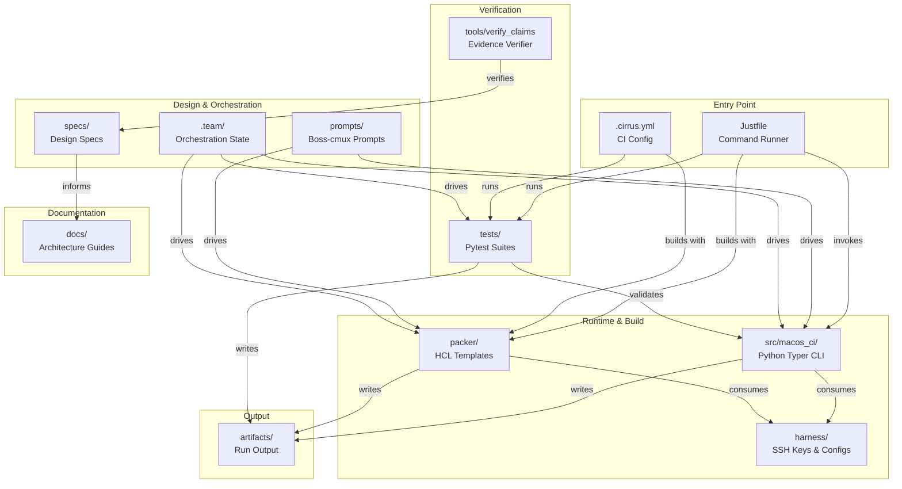

# Repo Structure

This page maps the top level of the `macos-ci` tree as of commit `4a36461` (branch `inital-spec`) and
says what each directory is *for*, not what every file in it contains. Where a directory's own design
is documented elsewhere, this page links out rather than duplicating that explanation.

## Top-level map

| Path | What it is |
|---|---|
| `specs/` | Markdown design specs, numbered `00`–`13`, plus `specs/plans/` (an HTML snapshot of the plan pinned to a commit — a derived rendering, not a 15th spec). Authoritative source of design rationale; see [specs/macos-ci/00-overview.md](../../specs/macos-ci/00-overview.md) for the reading order. |
| `.team/` | Multi-agent ("boss-cmux") run-tracking: board files, `claims.jsonl` (the verifiable-claims ledger), dispatch briefs, backlogs. Covered in the contributor docs, not here — see [docs/contributor/boss-cmux-workflow.md](../contributor/boss-cmux-workflow.md). |
| `.claude/` | Claude Code project configuration: `agents/` (project-specific subagents, e.g. `log-researcher.md`, `vm-debug.md`), `commands/`, `skills/` (e.g. `triage-logs/`, `triage-patterns/`), plus `settings.json`. |
| `src/macos_ci/` | The Python Typer CLI package — the `macos-ci` console script. See *The `macos_ci` package* below. |
| `tests/` | Pytest suite, split by marker into `unit/`, `integration/`, `gui/`, `manual/`, `pty/`. See *Test layout* below. |
| `harness/` | Fixed inputs the CLI package consumes at run time: an SSH keypair (`harness/ssh/`) the harness seeds into a fresh clone, and seed-config YAMLs (`harness/seed-config/`) for the chezmoi/dotfiles install under test. |
| `packer/` | Packer HCL templates: `tart-golden-image.pkr.hcl` (the OCI-clone golden-image build) and `ipsw/sequoia-15.6.1.pkr.hcl` (a from-IPSW build lane). See [docs/architecture/build-pipeline.md](build-pipeline.md). |
| `prompts/` | The three boss-cmux orchestration prompts (`macos-ci-research-team.md`, `macos-ci-build-team.md`, `macos-ci-verify-team.md`) that drive the multi-agent build fleet. Not re-explained here — see [docs/contributor/boss-cmux-workflow.md](../contributor/boss-cmux-workflow.md). |
| `tools/verify_claims.py` | Re-executes the evidence behind every claim in `.team/claims.jsonl` (`just verify-claims`). |
| `docs/` | This documentation tree (`architecture/`, `contributor/`, `tutorials/`). |
| `artifacts/` | Timestamped run output (`artifacts/<run-id>/state.json`, `verdict.json`, logs, screenshots) plus an `artifacts/latest` symlink. Gitignored. |
| `Justfile` | The primary command runner — every recipe wraps either `uv run macos-ci ...`, a bare `tart`/`packer` invocation, or a quality-gate tool. Full recipe reference: [docs/architecture/justfile-reference.md](justfile-reference.md). |
| `Makefile` | A thin pass-through wrapper to `just` (present for muscle-memory `make <target>` callers). |
| `.cirrus.yml` | Cirrus CI config — reproduces the apply-level pass/fail half of `just run` inside Cirrus's own tart backend, for local/CI parity. `just ci` wraps `cirrus run`. |
| `pyproject.toml` / `uv.lock` | Python project metadata and locked dependencies, managed by `uv`. See [docs/architecture/dependencies.md](dependencies.md). |
| `macos-versions.toml` | Maps a short image name (`sequoia`, `tahoe`) to the OCI ref Packer clones from, plus which one is `default`. |
| `.env.sample` | Template for `.env` (gitignored, holds exactly one key, `OPENAI_API_KEY`). The real `.env` is never read or quoted by tooling in this repo. |

## The `macos_ci` package

`src/macos_ci/` is organized around a deliberate **pure/impure split**, documented in
[specs/macos-ci/12-tooling-and-agent-loop.md](../../specs/macos-ci/12-tooling-and-agent-loop.md): every
public module pairs with a private `_*_core.py` module that holds the pure logic (argv construction,
version comparison, config parsing) and imports nothing that touches a subprocess, socket, filesystem,
or the clock. The public module is the I/O shell that calls it.

| Public module | Private core | Role |
|---|---|---|
| `cli.py` | — | Typer entrypoint; mounts `harness`, `gui`, `vm-debug` as sub-apps and wires the top-level `doctor` command. |
| `harness.py` | `_harness_core.py` | The VM lifecycle: `up`/`down`/`destroy`/`apply`/`run`/`prune`/`matrix`/`logs`. See [build-pipeline.md](build-pipeline.md). |
| `tart.py` | `_tart_core.py` | Thin `subprocess` wrapper over `tart clone`/`run`/`ip`/`delete`; `_tart_core.py` builds the argv and defines `DirMount`. |
| `doctor.py` | `_doctor_core.py` | Preflight: checks `tart`, `packer`, `just`, `uv`, `cirrus`, `sshpass` are present and version-gated (`tart>=2.0.0`, `packer>=1.10.0`), plus architecture, macOS version, keychain-unlocked state, `ZSH_DOTFILES` existence, and free disk space. Also reports (never gates on) the Fair Source fleet-ceiling notice — see [specs/macos-ci/04-tart-licensing-risk.md](../../specs/macos-ci/04-tart-licensing-risk.md). |
| `gui.py` | `_gui_core.py` | VNC connect / screenshot / keystroke helpers, mounted under the `gui` sub-app (`vnc`, `shot`). |
| `vm_debug.py` | `_triage_core.py` | Log sweep and failure-signature matching, mounted under the `vm-debug` sub-app (`sweep`). |
| `artifacts.py` | — | Writes `artifacts/<run-id>/*.json` and maintains the `artifacts/latest` symlink. No `_core` sibling — it's already pure I/O with no logic to separate out. |

`_config_core.py` (loading/validating `macos-versions.toml`) exists as a private core module without a
dedicated public I/O sibling yet — `harness.py` currently reads the TOML file directly and hands it to
`_config_core.load()`, a state the harness module's own docstring flags as temporary pending a `config.py`
owner module.

## Test layout

`tests/` mirrors the pytest markers declared in `pyproject.toml`'s `[tool.pytest.ini_options]`:

| Directory | Marker | What it needs |
|---|---|---|
| `tests/unit/` | *(none — the default tier)* | Nothing. Hermetic; fakes `tart`/`ssh` via `pytest-subprocess`. `just test` runs this tier only (`addopts` excludes `vm`, `pty`, `gui`, `manual` by default). |
| `tests/integration/` | `vm` | A live, already-`up` tart VM. `just verify` (`pytest -m vm`) runs testinfra assertions over SSH. |
| `tests/pty/` | `pty` | An interactive PTY (`pexpect` over `ssh -tt`). `just verify-pty`. |
| `tests/gui/` | `gui` | VNC framebuffer access. `just verify-gui`. |
| `tests/manual/` | `manual` | A human present to answer a y/n prompt — the only tier allowed to prompt one. `just verify-manual`. |
| `tests/fixtures/` | — | Static fixtures for the above: `packer-sensitive/` (a `.pkr.hcl` for the secrets-masking control) and `verifier/` (fixtures for `tools/verify_claims.py`'s own test suite). |

## Diagram

How the top-level directories above relate: the Justfile and `.cirrus.yml` as entry points, the
design/orchestration layer (`specs/`, `prompts/`, `.team/`) that drove building the runtime layer
(`src/macos_ci/`, `harness/`, `packer/`), and the verification layer (`tests/`, `tools/`) that checks it.

