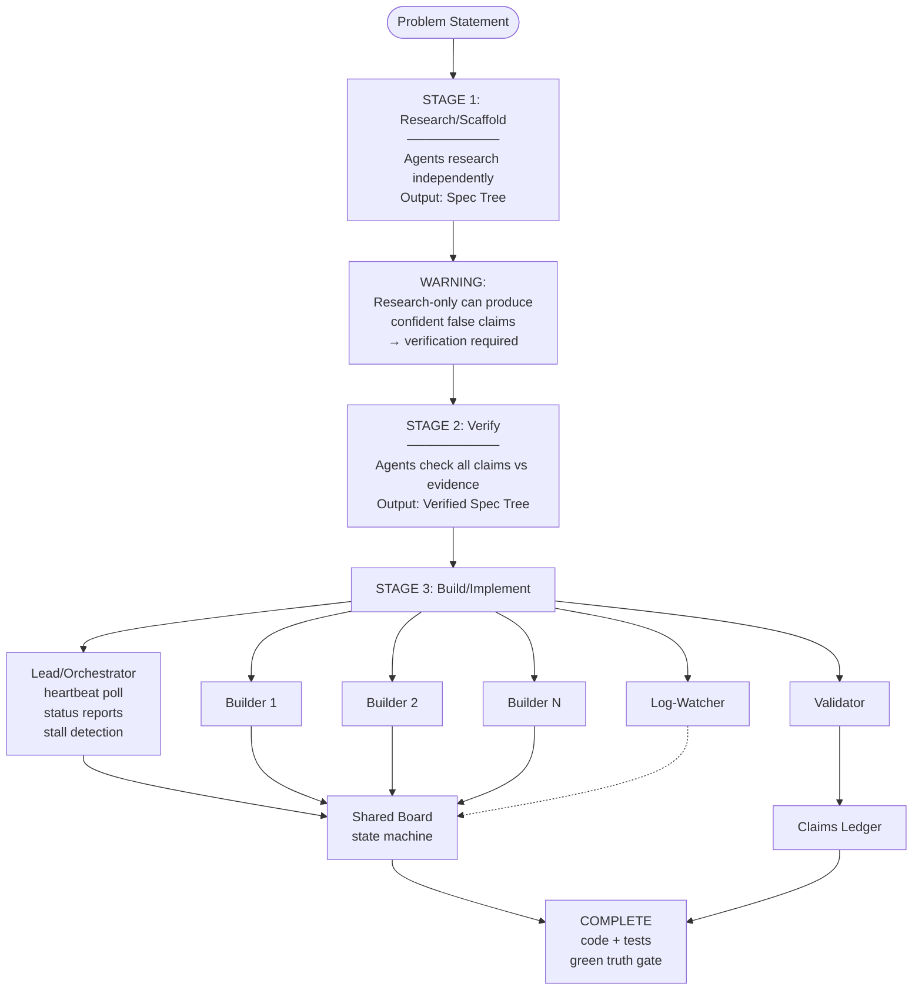

# The boss-cmux Three-Stage Pattern

**What you'll learn:** a reusable pattern for kicking off large, agent-driven work — research it,
verify it, then build it — using cmux (a terminal-multiplexer / multi-agent-surface control tool) to run
several agents in parallel panes instead of one linear chat.

**Prerequisites:** you know how to drive a single Claude Code session; you don't need prior cmux
experience.

**Time to read:** ~10 minutes. Applying it to a real task takes as long as the task does — the whole
point is that a big task gets three focused runs instead of one long, unverifiable one.

This repo (`macos-ci`) was itself built with this pattern. Its own orchestration prompts are checked
into [`prompts/`](../../prompts/) — [`macos-ci-research-team.md`](../../prompts/macos-ci-research-team.md),
[`macos-ci-verify-team.md`](../../prompts/macos-ci-verify-team.md), and
[`macos-ci-build-team.md`](../../prompts/macos-ci-build-team.md) — and this tutorial uses them as a
worked example throughout. But the pattern generalizes to any large task, not just this one.

## Why not just one long agent session?

A single agent researching a topic, designing a solution, and implementing it in one continuous run has
no built-in checkpoint where its own claims get checked against reality. It can sound confident and be
wrong. The three-stage pattern inserts a checkpoint between "we wrote something down" and "we started
building on it": a dedicated verify stage whose only job is to try to disprove what the research stage
produced.

## Stage 1: Research / scaffold

A human writes an orchestration prompt describing a problem. Several panes (agents) research
independently — reading docs, prior art, source code — and each writes a spec or design document for
its slice of the problem. The output is a **spec tree**: a set of markdown documents that together
describe the thing to be built.

**The risk at this stage is structural, not incidental:** a research-only run that has no verification
step, or worse, one that actively *forbids* re-checking its own findings, will ship confident-sounding
claims that are false. This repo's research run is the textbook case: it produced a "ground truth" (its
authors labeled it **G10**) asserting that four `docs.getutm.app` URLs were dead pages, and it
explicitly told every downstream reader "these URLs are 404 — do not fetch, do not cite." One of the
four had never existed at all — it was fabricated, not merely dead — and the "do not fetch" instruction
is exactly what prevented anyone from noticing. As the retraction later put it: *"A rule that forbids
verification does not protect truth. It launders a guess into an axiom."*

That failure is the reason stage 2 exists. If your own research-only run has no plan to re-verify its
claims, budget for stage 2 anyway — it is not optional polish, it is where fabrications get caught.

## Stage 2: Verify

Read-only agents re-derive and check **every** claim from stage 1 against real evidence: re-running the
CLI commands the spec cites, re-fetching the docs pages it quotes, re-checking every `file:line`
citation, confirming URLs actually exist (and actually say what's claimed, not just that they resolve).
Nothing is trusted by default; everything is either confirmed, refuted, or explicitly marked unverified.

Concretely, in this repo's verify run:

- Ground truths from stage 1 (`G1`–`G19`) and defects (`D1`–`D5`) were treated as **claims to refute**,
  not commandments — several were in fact retracted (the fabricated URL among them) or corrected (a
  defect's line-number citation turned out to be wrong too).
- Every non-obvious claim had to resolve to one of exactly four states: a passing, machine-checkable
  claim; an explicit `<!-- UNVERIFIED -->` marker tied to an open question; an entry in an open-questions
  file; or deletion. "It sounds right" is not a fifth state.
- Read-only commands were required, not just permitted, wherever they were possible: `--help`/`--version`
  probes, doc-site search-index queries, `packer inspect` (never `packer build`). If a claim *could* be
  checked with an allowed command and wasn't, that was treated as a defect in the run itself.
- The stage's exit criterion was a single command exiting 0 (`just check` in this repo — see
  [`team-coordination-mechanics.md`](team-coordination-mechanics.md) for what it actually runs), never a
  paraphrase of what the command probably would have said.

The output of this stage is a **corrected, verified spec tree** — the same documents, but now every
claim in them is either backed by re-executable evidence or honestly marked as unresolved.

## Stage 3: Build

A multi-pane team implements what the verified specs describe. This is where the pattern grows more
structure, because now there's mutation (code, VMs, real builds) instead of just reading:

- **An orchestrator/lead pane** drives the run. In this repo's build run that meant a heartbeat loop —
  poll every ~60 seconds, write a status report every ~2 minutes, and if nothing observable has changed
  for ~3 minutes during an active phase, treat that as a stall and go probe the quiet pane directly
  rather than keep waiting. The rule of thumb that motivated this: poll by **artifacts, not pixels** —
  screens go stale, but files and exit codes don't lie about whether something moved.
- **Several builder panes**, each owning a vertical slice of the work, so they can proceed in parallel
  without stepping on each other's files. This repo's build run split the work into a core-builder (the
  Python package), a packer-builder (the image templates), and a harness-builder (the live VM
  clone/run/assert cycle) — three independent slices behind one lead, each owning its own set of files.
- **A validator pane**, read-only, whose job is to check a builder's work against the acceptance
  criteria after it lands — not to write code itself.
- **A dedicated log-watcher pane**, useful whenever the build includes a long-running or noisy
  operation. Its job is triage, not narration: distinguish a transient failure that will resolve on its
  own (a network retry during an hour-scale image pull is "weather") from a fatal one (a broken template
  render is "climate") — and tell the lead which is which instead of crying wolf or going silent.
- **A shared "board" file** — a markdown state machine — is the single source of truth for where the run
  currently stands. Every pane reads it to know the current state and writes to it (or has the lead
  write to it) to advance the state, always by pasting real command output as evidence, never by
  paraphrasing what it probably showed.
- **A machine-checkable claims ledger**, carried over from stage 2 and extended as the build proceeds, so
  "the tests pass" and "the image builds" stay re-executable facts rather than turn-of-phrase status
  updates.

This repo's build run implemented `specs/macos-ci.md` steps 1–14 this way, red-first (write the failing
test, watch it fail, then implement), across 7 panes total (5 builder/watcher panes plus a lead plus one
plain, agent-less shell pane that actually ran the multi-hour Packer build). See
[`team-coordination-mechanics.md`](team-coordination-mechanics.md) for the concrete board and ledger
mechanics this repo uses today.

## Applying this to your own next big task

You don't need cmux specifically, and you don't need three separate cmux teams every time — the pattern
is the discipline, not the tool. What matters when you next face a large, multi-step piece of work:

1. **Separate "we wrote it down" from "we checked it."** If you're tempted to research and implement in
   one continuous pass, at minimum insert a deliberate re-verification pass before you trust any
   non-trivial claim (a URL, a CLI flag, a file:line citation, a cost figure) enough to build on it.
2. **Make verification re-executable, not narrated.** A claim that can be expressed as "run this command,
   check for this substring" is worth far more than a sentence asserting the same thing. If you can't
   express a claim that way, mark it explicitly as unverified rather than presenting inference as fact.
3. **When you do move to building in parallel, give each agent an owned slice of files** and a shared,
   append-only source of truth for run state — otherwise "what's the status" becomes a question only a
   human can answer by reading five transcripts.
4. **Assign someone (a pane, a role, or yourself) to watch for stalls and to triage noise vs. real
   failure** — a long build with no one distinguishing "still working" from "silently stuck" is how
   hours get lost waiting on nothing.

## Diagram

The general three-stage pattern, with the build stage's pane roles fanning out from a lead and
converging on a shared board.

